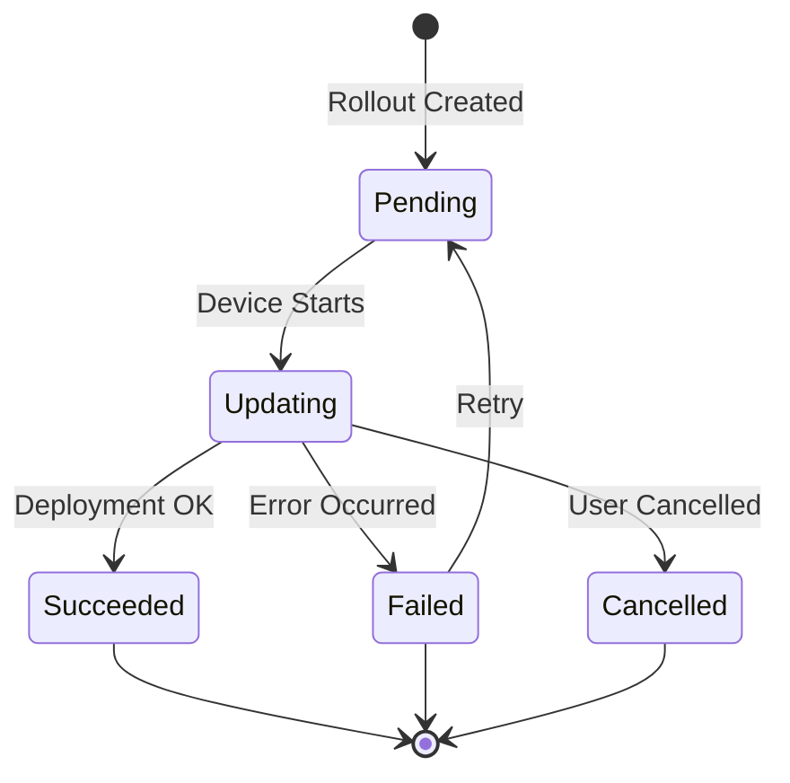
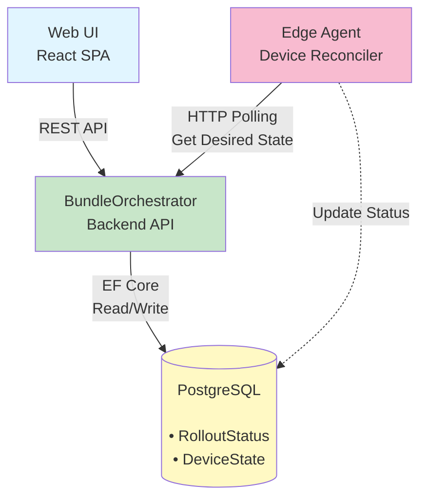
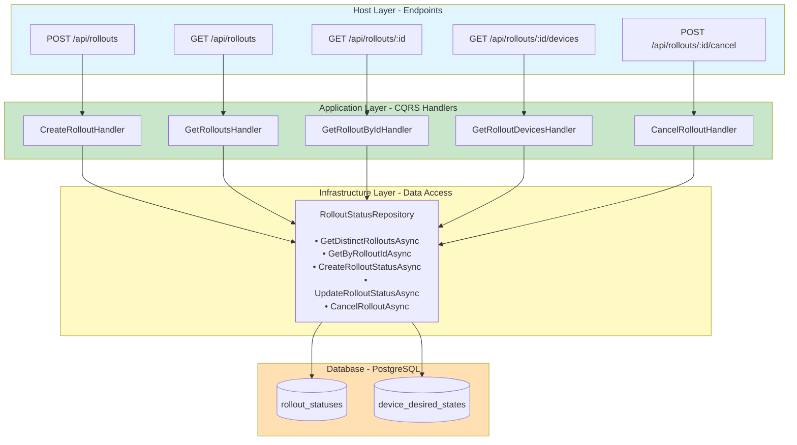
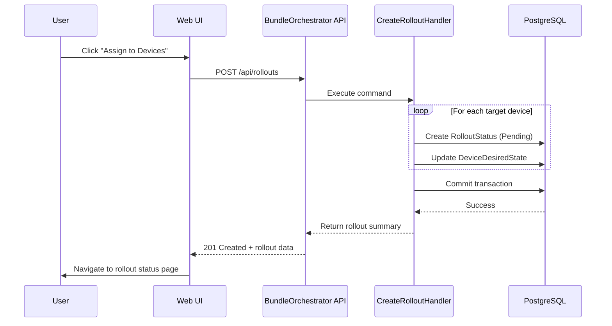
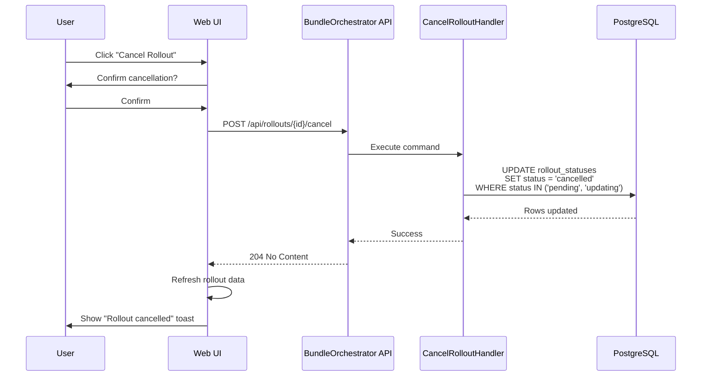
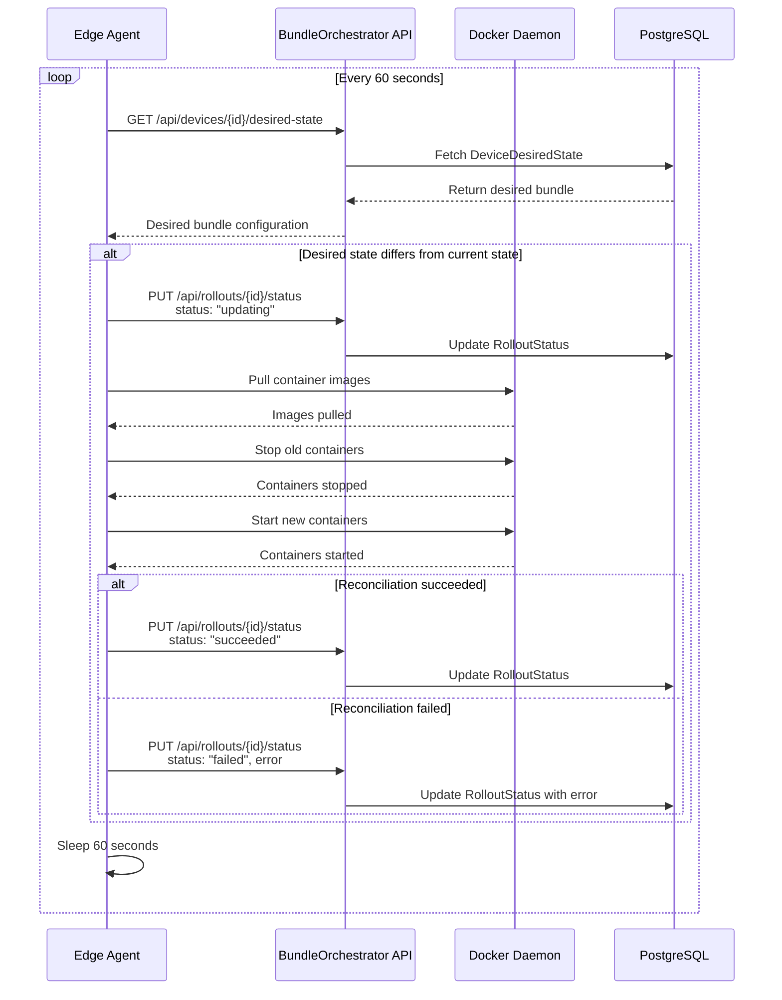

# Rollout Management

This document describes the Rollout Management feature in SignalBeam Edge, which enables controlled deployment of application bundles to edge devices with real-time progress tracking and status monitoring.

## Table of Contents

- [Overview](#overview)
- [Key Concepts](#key-concepts)
- [Architecture](#architecture)
- [Rollout States](#rollout-states)
- [API Reference](#api-reference)
- [User Interface](#user-interface)
- [Data Model](#data-model)
- [Workflows](#workflows)
- [Best Practices](#best-practices)
- [Troubleshooting](#troubleshooting)

## Overview

The Rollout Management system coordinates the deployment of application bundles across one or more edge devices. It provides:

- **Real-time progress tracking** - Monitor deployment progress as it happens
- **Device-level visibility** - See the status of each individual device
- **Automatic retries** - Retry failed deployments automatically
- **Rollout cancellation** - Stop in-progress rollouts when needed
- **Historical tracking** - View past rollouts and their outcomes

### Key Features

1. **Bulk Assignment**: Assign bundles to multiple devices or groups in a single operation
2. **Progress Monitoring**: Track deployment progress in real-time with automatic updates
3. **Status Tracking**: Monitor individual device deployment states (Pending, Updating, Succeeded, Failed, Cancelled)
4. **Rollout Control**: Cancel rollouts, retry failed devices, or view detailed deployment logs
5. **Historical View**: Browse past rollouts filtered by bundle or status

## Key Concepts

### Rollout

A **rollout** represents a single deployment operation that assigns a specific bundle version to one or more target devices. Each rollout has:

- **Unique ID**: Identifier for tracking and reference
- **Bundle**: The application bundle being deployed
- **Version**: Specific version of the bundle
- **Targets**: List of devices or groups receiving the deployment
- **Status**: Overall rollout state (Pending, In Progress, Completed, Failed, Cancelled)
- **Progress**: Aggregated statistics (total, pending, in progress, succeeded, failed, cancelled)
- **Timeline**: Created, updated, and completed timestamps

### Rollout Status

Each device in a rollout has its own **rollout status** tracking:

- **Device ID**: The target device
- **State**: Current deployment state for this device
- **Started At**: When deployment began for this device
- **Completed At**: When deployment finished (success or failure)
- **Error Message**: Failure details if applicable
- **Last Updated**: Most recent status update timestamp

### Rollout State Machine



## Architecture

### System Components



### Data Flow

1. **Create Rollout** (User → UI → API):
   - User selects bundle and target devices/groups
   - UI calls `POST /api/rollouts`
   - API creates rollout and device status records
   - UI redirects to rollout status page

2. **Monitor Rollout** (UI ↔ API):
   - UI polls `GET /api/rollouts/{id}` every 5 seconds
   - UI polls `GET /api/rollouts/{id}/devices` for device details
   - API aggregates status from database
   - UI updates progress bars and device lists

3. **Execute Rollout** (Device Agent ↔ API):
   - Agent polls `GET /api/devices/{id}/desired-state`
   - Agent reconciles container state
   - Agent reports status via `PUT /api/rollouts/{id}/status`
   - Database records updated

4. **Cancel Rollout** (User → UI → API → Devices):
   - User clicks "Cancel Rollout"
   - UI calls `POST /api/rollouts/{id}/cancel`
   - API updates pending/in-progress devices to "Cancelled"
   - Devices skip deployment on next poll

### Backend Architecture

**Hexagonal Architecture Layers:**



## Rollout States

### Overall Rollout Status

The overall rollout status is computed from individual device states:

| Status | Condition | Description |
|--------|-----------|-------------|
| **Pending** | All devices pending | Rollout created but no devices have started |
| **In Progress** | Any device updating or some succeeded | Deployment is actively happening |
| **Completed** | All devices succeeded | All devices deployed successfully |
| **Failed** | Some failed and none pending/updating | Some devices failed and rollout stopped |
| **Cancelled** | Any device cancelled | User cancelled the rollout |

### Device Rollout States

Each device progresses through these states:

| State | Description | Next States |
|-------|-------------|-------------|
| **Pending** | Deployment scheduled but not started | Updating, Cancelled |
| **Updating** | Device is pulling and applying bundle | Succeeded, Failed, Cancelled |
| **Succeeded** | Bundle deployed successfully | *(terminal state)* |
| **Failed** | Deployment failed with error | Pending (if retried) |
| **Cancelled** | Rollout was cancelled | *(terminal state)* |

## API Reference

### Create Rollout

Create a new rollout to deploy a bundle to devices or groups.

**Endpoint:** `POST /api/rollouts`

**Request Body:**
```json
{
  "bundleId": "f9c15f6f-a40f-40a8-9c6f-a2bf2786f590",
  "version": "1.2.0",
  "targetType": "device",
  "deviceIds": [
    "device-001",
    "device-002",
    "device-003"
  ]
}
```

**Response:** `201 Created`
```json
{
  "rolloutId": "550e8400-e29b-41d4-a716-446655440000",
  "bundleId": "f9c15f6f-a40f-40a8-9c6f-a2bf2786f590",
  "version": "1.2.0",
  "targetType": "device",
  "targetIds": ["device-001", "device-002", "device-003"],
  "status": "pending",
  "progress": {
    "total": 3,
    "pending": 3,
    "inProgress": 0,
    "succeeded": 0,
    "failed": 0,
    "cancelled": 0
  },
  "createdAt": "2025-12-23T10:00:00Z"
}
```

### Get Rollouts

Retrieve a paginated list of rollouts, optionally filtered by bundle.

**Endpoint:** `GET /api/rollouts`

**Query Parameters:**
- `bundleId` (optional): Filter by bundle ID
- `page` (default: 1): Page number
- `pageSize` (default: 10): Items per page

**Example:** `GET /api/rollouts?bundleId=f9c15f6f-a40f-40a8-9c6f-a2bf2786f590&page=1&pageSize=10`

**Response:** `200 OK`
```json
{
  "data": [
    {
      "id": "550e8400-e29b-41d4-a716-446655440000",
      "bundleId": "f9c15f6f-a40f-40a8-9c6f-a2bf2786f590",
      "version": "1.2.0",
      "targetType": "device",
      "targetIds": ["device-001", "device-002"],
      "status": "in_progress",
      "progress": {
        "total": 2,
        "pending": 0,
        "inProgress": 1,
        "succeeded": 1,
        "failed": 0,
        "cancelled": 0
      },
      "createdAt": "2025-12-23T10:00:00Z",
      "updatedAt": "2025-12-23T10:05:00Z",
      "completedAt": null
    }
  ],
  "page": 1,
  "pageSize": 10,
  "totalCount": 15,
  "totalPages": 2
}
```

### Get Rollout By ID

Retrieve detailed information about a specific rollout.

**Endpoint:** `GET /api/rollouts/{rolloutId}`

**Response:** `200 OK`
```json
{
  "id": "550e8400-e29b-41d4-a716-446655440000",
  "bundleId": "f9c15f6f-a40f-40a8-9c6f-a2bf2786f590",
  "version": "1.2.0",
  "targetType": "device",
  "targetIds": ["device-001", "device-002", "device-003"],
  "status": "in_progress",
  "progress": {
    "total": 3,
    "pending": 1,
    "inProgress": 1,
    "succeeded": 1,
    "failed": 0,
    "cancelled": 0
  },
  "createdAt": "2025-12-23T10:00:00Z",
  "updatedAt": "2025-12-23T10:05:30Z",
  "completedAt": null
}
```

### Get Rollout Devices

Get device-level status for all devices in a rollout.

**Endpoint:** `GET /api/rollouts/{rolloutId}/devices`

**Response:** `200 OK`
```json
{
  "rolloutId": "550e8400-e29b-41d4-a716-446655440000",
  "devices": [
    {
      "deviceId": "device-001",
      "deviceName": "Warehouse Sensor 1",
      "status": "succeeded",
      "startedAt": "2025-12-23T10:00:15Z",
      "completedAt": "2025-12-23T10:02:45Z",
      "errorMessage": null
    },
    {
      "deviceId": "device-002",
      "deviceName": "Warehouse Sensor 2",
      "status": "updating",
      "startedAt": "2025-12-23T10:01:00Z",
      "completedAt": null,
      "errorMessage": null
    },
    {
      "deviceId": "device-003",
      "deviceName": "Warehouse Sensor 3",
      "status": "pending",
      "startedAt": null,
      "completedAt": null,
      "errorMessage": null
    }
  ]
}
```

### Cancel Rollout

Cancel a rollout, stopping all pending and in-progress deployments.

**Endpoint:** `POST /api/rollouts/{rolloutId}/cancel`

**Response:** `204 No Content`

Cancelled devices will have their status set to "Cancelled" and will skip the deployment on their next reconciliation cycle.

## User Interface

### Rollout Status Page

The rollout status page (`/rollouts/{rolloutId}`) provides comprehensive visibility into deployment progress.

**Key Components:**

1. **Header Section**
   - Rollout ID and creation timestamp
   - Bundle name and version
   - Quick action buttons (Refresh, Cancel)

2. **Progress Overview Cards**
   - Overall rollout status badge
   - Progress bar showing completion percentage
   - Breakdown by device count (Total, Pending, Updating, Succeeded, Failed, Cancelled)

3. **Device Status Table**
   - Tabbed interface to filter by status (All, Pending, Updating, Succeeded, Failed, Cancelled)
   - Columns: Device Name, Status, Started At, Completed At, Duration, Error Message
   - Status badges with color coding
   - Sortable columns

4. **Auto-Refresh**
   - Automatically refreshes every 5 seconds for active rollouts
   - Stops auto-refresh when rollout is completed/failed/cancelled
   - Manual refresh button always available

**Navigation:**
- **From Bundle Detail Page**: "Rollouts" tab shows history for the bundle
- **After Bundle Assignment**: Automatically navigates to rollout status page
- **From Dashboard**: Direct link in recent rollouts widget

### Bundle Detail Page - Rollouts Tab

The "Rollouts" tab on the bundle detail page shows rollout history:

**Features:**
- Paginated table of rollouts for this bundle
- Sortable by date (newest first)
- Status badges (Pending, In Progress, Completed, Failed, Cancelled)
- Progress summary (e.g., "2/3 succeeded")
- "View Details" button to navigate to rollout status page

## Data Model

### RolloutStatus Entity

```csharp
public class RolloutStatus
{
    public Guid Id { get; set; }
    public Guid RolloutId { get; set; }          // Groups devices in same rollout
    public DeviceId DeviceId { get; set; }       // Target device
    public BundleId BundleId { get; set; }       // Bundle being deployed
    public BundleVersion BundleVersion { get; set; }
    public RolloutState Status { get; set; }     // Pending, Updating, Succeeded, Failed, Cancelled
    public DateTimeOffset StartedAt { get; set; }
    public DateTimeOffset? CompletedAt { get; set; }
    public string? ErrorMessage { get; set; }
}
```

### Database Schema

```sql
CREATE TABLE rollout_statuses (
    id UUID PRIMARY KEY DEFAULT gen_random_uuid(),
    rollout_id UUID NOT NULL,
    device_id UUID NOT NULL,
    bundle_id UUID NOT NULL,
    bundle_version VARCHAR(50) NOT NULL,
    status VARCHAR(20) NOT NULL,  -- 'pending', 'updating', 'succeeded', 'failed', 'cancelled'
    started_at TIMESTAMP WITH TIME ZONE NOT NULL,
    completed_at TIMESTAMP WITH TIME ZONE,
    error_message TEXT,
    created_at TIMESTAMP WITH TIME ZONE DEFAULT NOW(),
    updated_at TIMESTAMP WITH TIME ZONE DEFAULT NOW(),

    CONSTRAINT fk_device FOREIGN KEY (device_id) REFERENCES devices(id),
    CONSTRAINT fk_bundle FOREIGN KEY (bundle_id) REFERENCES bundles(id)
);

-- Index for querying rollouts by bundle
CREATE INDEX idx_rollout_statuses_bundle_id ON rollout_statuses(bundle_id);

-- Index for querying devices in a rollout
CREATE INDEX idx_rollout_statuses_rollout_id ON rollout_statuses(rollout_id);

-- Index for querying device status
CREATE INDEX idx_rollout_statuses_device_id ON rollout_statuses(device_id);
```

## Workflows

### Creating a Rollout

**User Story:** As a fleet manager, I want to deploy a new bundle version to multiple devices.

**Steps:**

1. Navigate to Bundle Detail page (`/bundles/{bundleId}`)
2. Click "Assign to Devices" button
3. In the dialog:
   - Select target devices or groups
   - Confirm bundle version
   - Click "Assign"
4. System creates rollout and redirects to rollout status page
5. Monitor progress in real-time

**Backend Flow:**



### Monitoring a Rollout

**User Story:** As a fleet manager, I want to track deployment progress in real-time.

**Steps:**

1. Navigate to rollout status page (`/rollouts/{rolloutId}`)
2. View overall progress and device breakdown
3. Filter devices by status using tabs
4. Investigate failed devices by reading error messages
5. Auto-refresh keeps page up-to-date

**Frontend Polling:**

```typescript
// Auto-refresh every 5 seconds for active rollouts
const { data: rollout, refetch } = useRollout(rolloutId, {
  refetchInterval: (data) => {
    const isActive = data?.status === 'pending' || data?.status === 'in_progress'
    return isActive ? 5000 : false  // 5 seconds or disabled
  }
})
```

### Cancelling a Rollout

**User Story:** As a fleet manager, I want to stop a problematic rollout.

**Steps:**

1. On rollout status page, click "Cancel Rollout"
2. Confirm cancellation in dialog
3. System marks pending/in-progress devices as "Cancelled"
4. Devices skip deployment on next poll

**Backend Flow:**



### Device Reconciliation

**User Story:** As an edge device, I want to automatically apply the desired bundle.

**Steps:**

1. Agent polls `GET /api/devices/{id}/desired-state` every 60 seconds
2. Compare desired bundle with current bundle
3. If different:
   - Update status to "Updating" via `PUT /api/rollouts/{id}/status`
   - Pull new container images
   - Stop old containers
   - Start new containers
   - Report success/failure
4. Agent continues heartbeats with current bundle version

**Agent Reconciliation Flow:**



**Agent Reconciliation Loop (C# code):**

```csharp
while (true)
{
    var desiredState = await GetDesiredState();
    var currentState = GetCurrentContainerState();

    if (desiredState != currentState)
    {
        await UpdateRolloutStatus(RolloutState.Updating);

        try
        {
            await ReconcileContainers(desiredState);
            await UpdateRolloutStatus(RolloutState.Succeeded);
        }
        catch (Exception ex)
        {
            await UpdateRolloutStatus(RolloutState.Failed, ex.Message);
        }
    }

    await Task.Delay(TimeSpan.FromSeconds(60));
}
```

## Best Practices

### Creating Rollouts

1. **Test on a single device first** - Before rolling out to many devices, test on one
2. **Use device groups** - Target groups instead of individual devices for scalability
3. **Version bundles semantically** - Use semantic versioning (e.g., 1.2.0 → 1.2.1)
4. **Monitor progress actively** - Watch the rollout status page during deployment
5. **Have a rollback plan** - Keep previous bundle versions available

### Monitoring Rollouts

1. **Check failed devices immediately** - Investigate error messages promptly
2. **Filter by status** - Use tabs to focus on specific device states
3. **Sort by completion time** - Identify slow devices
4. **Note error patterns** - Multiple devices failing similarly indicates a systemic issue
5. **Use auto-refresh** - Let the UI update automatically for active rollouts

### Handling Failures

1. **Read error messages** - Detailed error information is in the device table
2. **Check device logs** - SSH to device or use log aggregation
3. **Verify network connectivity** - Ensure device can reach container registry
4. **Validate bundle configuration** - Check container image URLs and environment variables
5. **Retry selectively** - Fix the issue before retrying failed devices

### Performance Optimization

1. **Limit concurrent rollouts** - Don't start too many rollouts simultaneously
2. **Use efficient target selection** - Device groups are more efficient than individual device lists
3. **Pre-pull images** - Consider pre-pulling images during off-peak hours
4. **Stagger deployments** - For large fleets, deploy in waves
5. **Monitor database performance** - Ensure indexes are optimized for rollout queries

## Troubleshooting

### Rollout Stuck in "Pending"

**Symptom:** All devices remain in "Pending" state indefinitely.

**Possible Causes:**
1. Devices are offline
2. Devices can't reach the API
3. Agent reconciliation loop is not running

**Solutions:**
- Check device connectivity and agent logs
- Verify API endpoint is accessible from devices
- Restart edge agent service on devices

### Devices Failing with "Image Pull Error"

**Symptom:** Multiple devices fail with container image pull errors.

**Possible Causes:**
1. Container registry is unreachable
2. Invalid image URL in bundle definition
3. Authentication required for private registry

**Solutions:**
- Verify container registry is accessible
- Check bundle definition for correct image URLs
- Configure image pull secrets on devices

### Rollout Page Not Updating

**Symptom:** Progress doesn't update even though devices are deploying.

**Possible Causes:**
1. Auto-refresh disabled or not working
2. API returning stale data
3. Frontend caching issues

**Solutions:**
- Click manual "Refresh" button
- Check browser console for errors
- Clear browser cache and reload page

### High Database Load During Rollouts

**Symptom:** Database CPU spikes during large rollouts.

**Possible Causes:**
1. Missing database indexes
2. Too many devices polling simultaneously
3. Inefficient queries

**Solutions:**
- Ensure indexes exist on `rollout_id`, `device_id`, `bundle_id`
- Implement query result caching with Valkey
- Stagger device polling intervals

### "Rollout Not Found" Error

**Symptom:** 404 error when accessing rollout status page.

**Possible Causes:**
1. Rollout ID is invalid
2. Rollout was deleted
3. Database connection issue

**Solutions:**
- Verify rollout ID is correct
- Check if rollout exists in database: `SELECT * FROM rollout_statuses WHERE rollout_id = '{id}'`
- Verify database connectivity

## Future Enhancements

The following features are planned for future releases:

1. **Staged Rollouts** - Deploy to devices in waves (e.g., 10%, 50%, 100%)
2. **Canary Deployments** - Test on a subset before rolling out to all
3. **Automatic Rollbacks** - Revert on high failure rate
4. **Scheduled Rollouts** - Deploy at a specific date/time
5. **Rollout Policies** - Define max failures, timeouts, retry strategies
6. **Notifications** - Email/Slack alerts for rollout completion or failures
7. **Webhooks** - Trigger external systems on rollout events
8. **Metrics** - Prometheus metrics for rollout success rate, duration, etc.

## Related Documentation

- [Technical Architecture](../architecture/technical-architecture.md) - System architecture overview
- [API Documentation](../architecture/api-overview.md) - Complete API reference
- [Device Management](devices.md) - Device lifecycle and grouping
- [Bundle Management](bundles.md) - Creating and versioning bundles
- [Local Development](../development/local-development.md) - Development setup

## Appendix

### Example: Complete Rollout Lifecycle

```bash
# 1. Create a rollout
curl -X POST http://localhost:5002/api/rollouts \
  -H "Content-Type: application/json" \
  -d '{
    "bundleId": "f9c15f6f-a40f-40a8-9c6f-a2bf2786f590",
    "version": "1.2.0",
    "targetType": "device",
    "deviceIds": ["device-001", "device-002", "device-003"]
  }'

# Response: { "rolloutId": "550e8400-e29b-41d4-a716-446655440000", ... }

# 2. Monitor rollout progress
curl http://localhost:5002/api/rollouts/550e8400-e29b-41d4-a716-446655440000

# 3. Get device-level status
curl http://localhost:5002/api/rollouts/550e8400-e29b-41d4-a716-446655440000/devices

# 4. Cancel rollout (if needed)
curl -X POST http://localhost:5002/api/rollouts/550e8400-e29b-41d4-a716-446655440000/cancel

# 5. List all rollouts for a bundle
curl "http://localhost:5002/api/rollouts?bundleId=f9c15f6f-a40f-40a8-9c6f-a2bf2786f590&page=1&pageSize=10"
```

### Example: SQL Queries

```sql
-- Get all rollouts with progress
SELECT
    rollout_id,
    COUNT(*) as total_devices,
    SUM(CASE WHEN status = 'pending' THEN 1 ELSE 0 END) as pending,
    SUM(CASE WHEN status = 'updating' THEN 1 ELSE 0 END) as updating,
    SUM(CASE WHEN status = 'succeeded' THEN 1 ELSE 0 END) as succeeded,
    SUM(CASE WHEN status = 'failed' THEN 1 ELSE 0 END) as failed,
    SUM(CASE WHEN status = 'cancelled' THEN 1 ELSE 0 END) as cancelled
FROM rollout_statuses
GROUP BY rollout_id
ORDER BY MAX(started_at) DESC;

-- Get failed devices with error messages
SELECT
    device_id,
    bundle_version,
    error_message,
    started_at,
    completed_at
FROM rollout_statuses
WHERE rollout_id = '550e8400-e29b-41d4-a716-446655440000'
    AND status = 'failed'
ORDER BY completed_at DESC;

-- Get average rollout duration by bundle
SELECT
    bundle_id,
    AVG(EXTRACT(EPOCH FROM (completed_at - started_at))) as avg_duration_seconds
FROM rollout_statuses
WHERE status = 'succeeded'
    AND completed_at IS NOT NULL
GROUP BY bundle_id;
```
